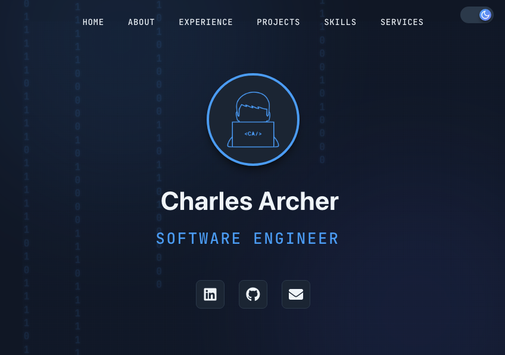

# Developer Portfolio

A modern, responsive portfolio website built with React, featuring smooth animations, theme switching, and easy customization through JSON configuration.



## ✨ Features

- **Responsive Design** - Optimized for all device sizes
- **Dark/Light Theme** - Seamless theme switching with persistent preferences
- **Smooth Animations** - Engaging transitions and scroll effects
- **Easy Customization** - Update content through a single JSON file
- **Project Showcase** - Interactive project cards with modal galleries
- **Skills Display** - Organized skill categories with icon integration
- **Experience Timeline** - Professional work history presentation
- **Contact Integration** - Direct email and social media links

## 🚀 Quick Start

### Prerequisites

- Node.js
- npm or yarn

### Installation

1. Clone the repository
```bash
git clone https://github.com/charlesarcher72/developer-portfolio.git
cd developer-portfolio
```

2. Install dependencies
```bash
npm install
```

3. Start the development server
```bash
npm start
```

4. Open [http://localhost:3000](http://localhost:3000) in your browser

## 📝 Customization

### Update Portfolio Content

All portfolio content is managed through `public/portfolio_data.json`. Simply edit this file to update:

- Personal information and bio
- Skills and technologies
- Work experience
- Projects and case studies
- Services offered
- Social media links

### Example Configuration

```json
{
  "info": {
    "name": "Your Name",
    "titles": ["Software Engineer", "Full Stack Developer"],
    "description": "Your professional bio...",
    "social": [
      {
        "name": "linkedin",
        "url": "https://linkedin.com/in/yourprofile"
      }
    ]
  }
}
```

### Add Your Images

Place your images in the `public/images/` directory:
- `headshot.jpg` - Your profile photo
- `logo-light.png` - Light theme logo
- `logo-dark.png` - Dark theme logo
- `icons/` - Social media icons (github.png, linkedin.png, mail.png)
- `portfolio/` - Project screenshots organized in subdirectories
  - Create a folder for each project (e.g., `portfolio/my-project/`)
  - Add multiple images per project for the gallery view
- `favicon.ico` - Browser tab icon (in public root)
- `YourName_Resume.pdf` - Your resume file (in public root)

### Theme Customization

Modify theme colors in `src/scss/theme.scss`:

```scss
:root {
  --primary-color: #your-color;
  --background-color: #your-color;
  // ... more variables
}
```

## 🛠️ Technologies Used

- **React** - UI framework
- **React Bootstrap** - UI components
- **SCSS** - Styling and theming
- **React Typical** - Text animations
- **Font Awesome & Devicon** - Icons

## 📦 Project Structure

```
developer-portfolio/
├── public/
│   ├── images/
│   ├── portfolio_data.json
│   ├── index.html
│   ├── manifest.json
│   └── favicon.ico
├── src/
│   ├── components/          # React components
│   │   ├── About.js
│   │   ├── Experience.js
│   │   ├── Footer.js
│   │   ├── Header.js
│   │   ├── Nav.js
│   │   ├── ProjectModal.js
│   │   ├── Projects.js
│   │   ├── Services.js
│   │   ├── Skills.js
│   │   └── ThemeToggle.js
│   ├── scss/               # Component stylesheets
│   │   ├── About.scss
│   │   ├── App.scss
│   │   ├── Experience.scss
│   │   ├── Footer.scss
│   │   ├── Header.scss
│   │   ├── Nav.scss
│   │   ├── Projects.scss
│   │   ├── Services.scss
│   │   ├── Skills.scss
│   │   ├── theme.scss      # Theme variables
│   │   └── ThemeToggle.scss
│   ├── context/            # React context providers
│   │   └── NavContext.js
│   ├── App.js              # Main app component
│   ├── index.js            # Entry point
│   ├── index.scss
│   └── serviceWorker.js
└── package.json
```

## 🎨 Components

### Header
Hero section with animated typing effect and binary rain background

### Nav
Sticky navigation bar with smooth scrolling and mobile menu

### About
Personal introduction with profile photo and resume download

### Experience
Professional work history with technologies used

### Projects
Interactive project showcase with image galleries and detailed modals

### Skills
Categorized skill display with icon integration

### Services
Offered services with email contact functionality

### Footer
Social media links and copyright information

### ThemeToggle
Dark/light theme switcher with persistent preferences

## 📱 Responsive Breakpoints

- Mobile: < 768px
- Tablet: 768px - 1024px
- Desktop: > 1024px

## 🚢 Deployment

### Build for Production

```bash
npm run build
```

### Deploy to Vercel

1. Install Vercel CLI
```bash
npm i -g vercel
```

2. Deploy
```bash
vercel
```

### Deploy to Netlify

1. Build the project
```bash
npm run build
```

2. Drag and drop the `build` folder to Netlify

## 🤝 Contributing

Contributions are welcome! Feel free to:

1. Fork the project
2. Create your feature branch (`git checkout -b feature/AmazingFeature`)
3. Commit your changes (`git commit -m 'Add some AmazingFeature'`)
4. Push to the branch (`git push origin feature/AmazingFeature`)
5. Open a Pull Request

## 📧 Contact

Charles Archer - [@charlesarcher72](https://github.com/charlesarcher72)

Project Link: [https://github.com/charlesarcher72/developer-portfolio](https://github.com/charlesarcher72/developer-portfolio)

## 🙏 Acknowledgments

- [React](https://reactjs.org/)
- [Font Awesome](https://fontawesome.com/)
- [Devicon](https://devicon.dev/)
- [React Bootstrap](https://react-bootstrap.github.io/)

---

Made with ❤️ by Charles Archer